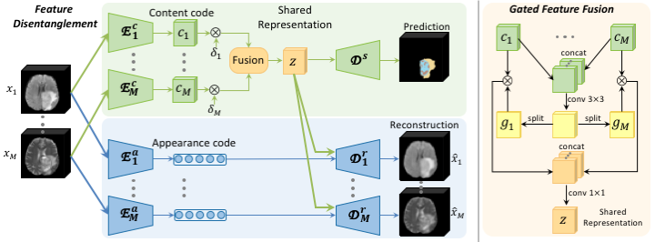

# Robust Multimodal Brain Tumor Segmentation via Feature Disentanglement and Gated Fusion

Tensorflow implementation of our robust multimodal brain tumor segmentation framework. <br/>

## Paper
[Robust Multimodal Brain Tumor Segmentation via Feature Disentanglement and Gated Fusion](https://arxiv.org/abs/2002.09708) MICCAI 2019
<p align="center">
  
</p>

## Installation
* Install TensorFlow 1.10 and CUDA 9.0
* Clone this repo
```
git clone https://github.com/cchen-cc/Robust-Mseg
cd Robust-Mseg
```

## Data Preparation
* Use `nii2tfrecord` function in `./preprocessing.py` to convert `nii` data into `tfrecord` format to be decoded by `./data_loader.py`

## Train
* Specify the data path in `./main.py`
* Run `./main.py` to start the training process

## Evaluate
* Our trained models can be downloaded from [Dropbox](https://www.dropbox.com/sh/euaxpyvtni1iy17/AABDOj0Q_xYdbbNnTJmlR2zpa?dl=0).
* Specify the model path and data path in `./evaluate.py`
* Run `./evaluate.py` to start the evaluation.

## Citation
If you find the code useful for your research, please consider cite our paper.
```
@inproceedings{chen2019robust,
  title={Robust multimodal brain tumor segmentation via feature disentanglement and gated fusion},
  author={Chen, Cheng and Dou, Qi and Jin, Yueming and Chen, Hao and Qin, Jing and Heng, Pheng-Ann},
  booktitle={International Conference on Medical Image Computing and Computer-Assisted Intervention},
  pages={447--456},
  year={2019},
  organization={Springer}
}
```
## Note
* Contact: Cheng Chen (chencheng236@gmail.com)
